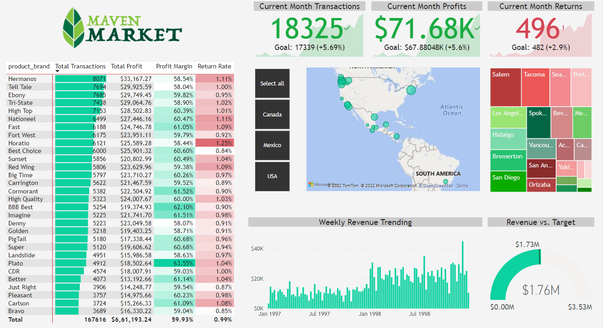

#Divyanshu Goyal - Data Analysis Portfolio

##About

Hi, I am Divyanshu Goyal! I am a student currently in my final year pursuing BBA from Mahraja Agrasen Institute of Management Studies. I have the necessary skillsets to analyse data with the help of tools like Python, MySQL, Excel and Power BI. I am looking for job opportunities for a data analyst role to apply my learnings and create insights for the business. Always looking to further my skillsets in the field by learning new techniques and methods for analysing data and making predictions. 

This website is to showcase my skills, projects and articles that I have posted about my learnings. 

##Table of contents

# [Data Cleaning & Visualization: Startup Funding Analysis in India (2015-2020)](https://github.com/divyanshu905/Startup_Funding)
• Used Python and Pandas to clean the data used.

• Created a dashboard on Power BI and found the following insights -

       1) Around 38 Billion Dollars invested in 2343 unique startups during the period.
       2) E-commerce saw the highest amount of funding raised (36.5%) with Flipkart at the top.
       3) Westbridge Capital invested the highest amount of money with 38 Billion Dollars invested 
       according to the dataset.
       4) Bengaluru startups raised the most amount of money during the period.

## [Exploratory Data Analysis with Python: Analyzing survey dataset on ideas of masculinity within different demography](https://github.com/divyanshu905/Masculinity_survey_analysis)
• Conducted exploratory data analysis to find insights on how ideas of masculinity differed within different demographies.

• Used Python, Matplotlib, Seaborn & Pandas to conduct in detailed EDA.
       

## [Power BI Dashboard Visualization: Performance Summary Dashboard](https://github.com/divyanshu905/PowerBI_Performance_Summary_Dashboard)
• Made performance dashboard to summarize company's revenue trends, product and stores performance

# [Driving Insights with SQL: Analyze company's growth patterns and trends with SQL](https://gist.github.com/divyanshu905/71e2eef193365a34ebaac71cb9a5acc1)

• MySQL was used to query and analyse patterns and trends in order to determine the company's growth patterns.

• Derived the suggestions down below - 
       
       1) Identified the opportunity to launch a new product.
       2) Suggested strategy to optimize marketing spend through focusing on successful channels.
       3) Revealed possibilities of improvement by understanding revenue trend.
       4) Analyzed website's customer funnel to find areas leading to high bounce rate.
       5) Revenue and margin by product along with total revenue and margin monthly.
       6) Analyzed products that sell well together to optimize cross selling.
       

